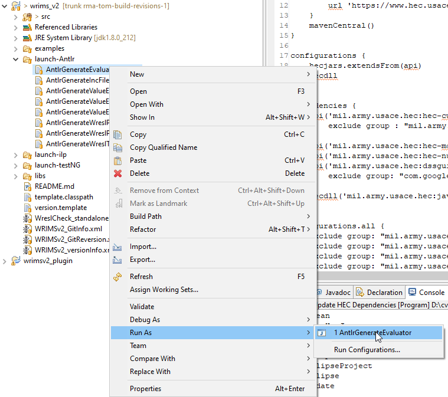

# Building wrimsv2_plugin from this repo
The working build system as of December 2023 uses a mixture of Java 6 and Java 8 in Eclipse Luna SR2 
(v 4.4.2 - Februay 2015) with support for plugin development. 

The build evironment requires a very specific setup on the D: driver of a Windows computer.
  - If you don't have a D: drive, you will need to create one with the Windows "subst" command.

The source and most of the Java build configuration is in this repo, but much of what WRIMS does requires 
executables that are not present here, and were added to the install directory of the Eclipse IDE 
used to build WRIMS. This means that you can't WRIMS using just the IDE as you would download it from 
Eclipse. You *must* use the same Eclipse IDE and Eclipse workspace that DWR's developers did. These are 
provided [where?] in the form of .zip or .7z archive files. They'll be called zip files in this document.

- This git repository must be located in "D:\cvwrsm\trunk although it is not necessary to clone the repo 
to that location on your computer.
  - Clone RMA's GitHub repo for CVWRSM (https://github.com/rmanet/cvwrsm.git) to your PC. No special location is required; follow your usual practice for git repositories if you have one.
  - Create "trunk" as a symbolic link from wherever you cloned the repo to on your computer to the above. This command does that:
    - `D:\cvwrsm>mklink /D trunk D:\VCS\github.com\cvwrsm`
    - Your target will not be the same as this ^^^
    - You will need admin privileges on your PC to run this command.
    - The link was successfully created if your git client sees D:\cvwrsm\trunk as a git repo.
  - From your git client, check out the "Feature/HecDSS7" branch of cvwrsm. (Command-line: `git checkout Feature/HecDSS7`)
- The Eclipse IDE can be installed in "D:\eclipse-rcp-luna-SR2-win32-x86_64"
  - It's important to use a copy of the Eclipse IDE that's installed from the .zip (or .7z) file that DWR provided, because it contains components of the WRIMS install that aren't part of the Eclipse workspace or the git repo.
    - For reference, the IDE itself (with OGSi plugin development tools) can be found in the Eclipse archives at
      - https://www.eclipse.org/downloads/packages/release/luna/r/eclipse-rcp-and-rap-developers
- The Eclipse workspace must be located in "D:\dev_luna_x64"
  - dev_luna_x64.zip --> D:\dev_luna_x64 
  -  ^^^ The Eclipse workspace for WRIMS, as provided by DWR (may be .7z of .zip file)
- Install the contents of this 7-zip archive as you choose. J:\DWR
  - _SampleDSS_CalSimII.7z  --> J:\DWR\_SampleDSS_CalSimII (for example)

With the above steps completed, launch Eclipse from D:\eclipse-rcp-luna-SR2-win32-x86_64\eclipse\eclipse.exe

In Eclipse:
- From the "Package Explorer" panel, right-click and select "import," to open the import wizard.
  - Choose the option "Existing Projects into Workspace" and press the "Next" button.
  - Browse to D:\cvwrsm\trunk and import the project `mil.army.usace.hec-dependencies`

- Close all projects in the Package Explorer except
	- `mil.army.usace.hec-dependencies`
	- `gov.ca.dwr.hecdssvue`
	- `gov.ca.dwr.jdiagram`
	- `wrims_v2`
	- `wrimsv2_plugin`

        Note that the `wrims_v2` and `wrimsv2_plugin` projects are located in `D:\cvwrsm\trunk\wrims_v2`

- Select `mil.army.usace.hec-dependencies` in the package explorer, then , from the project menu, run "Clean..." and "Build Project"
  - You may have to refresh (from right-click menu on its entry in the Package Explorer) and rebuild this project to get a clean build.

- Select and expand `wrms_v2` in the package explorer. 
  - Expand the `launch-Antler`node and run all the launchers
  - Clean and build the `wrms_2` project

- Select `wrimsv2_plugin` project in the Package Explorer and select Build Path=>Configure Build Path... from the right-click menu. If the JRE System Library is "unbound" in the dialog that follows, select it, and click the Edit... button. Select the workspace default JRE, and close the dialogs.

- From the project menu, run "Clean..." followed by "Build All"

- In `wrimsv2_plugin`, select WRIMS2_plugin.launch and pick Run As=>WRIMS2_plugin from the right-click menu. 
- This launches the WRIMS application. You'll see an Eclipse splash screen, and some messages in the console window. The WRIMS app should run in spite of the messages.

In WRIMS, these steps will verify that the build was successful:

- Close the Welcome tab to uncover the WRIMS features.

- From the Windows menu, select "Open Perspective"=>Other... and pick "DSS" from the list
- From the Windows menu, select "Open Perspective"=>Other... and pick "CalSimHydro" from the list

- Activate the "DSS" perspective in the upper-right corner of the app (below the menu bar).

- In the bottom panel, select the "DSS Files Compare" tab, and press the "Open Project" button.
- Browse to and select the project file "J:\DWR\_sampleDSS\CalSimII\test.dsv"

NOTES:

1. The Eclipse IDE can be installed anywhere. The first time you launch Eclipse Luna, it will 
create a default workspace that isn't the one you need for the WRIMS build, but you can switch to another. From Eclipse's File menu, select "Switch Workspace" and navigate to D:\dev_luna_x64.

2. The Eclipse framework that WRIMS plugs in to is launched from the IDE install folder. 
The CalSim executables have been installed in that folder as well. WRIMS launches the CalSim 
programs from that location, and that appears to work even if the IDE is not installed on the D: 
drive. Tests were successful, but not exhaustive.
